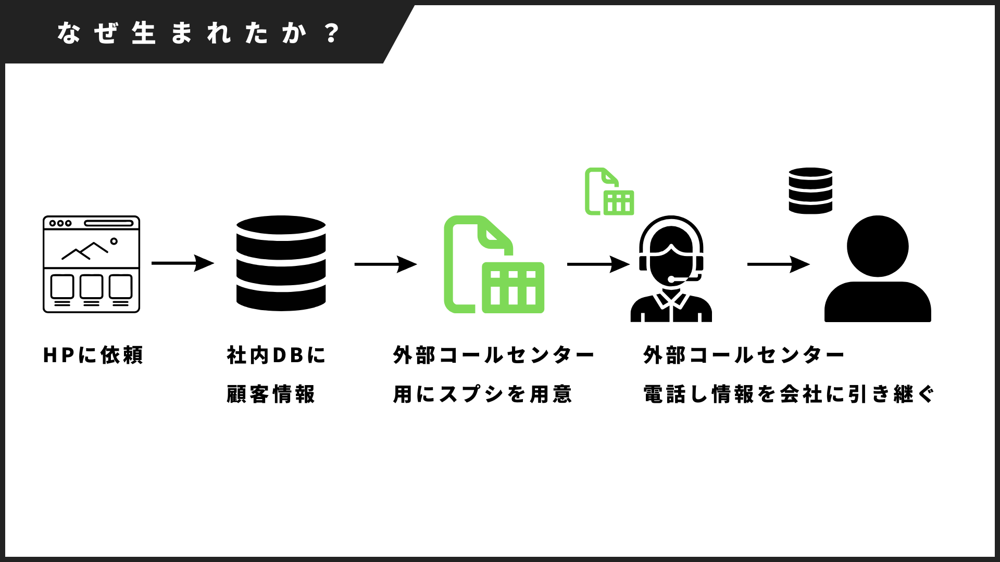
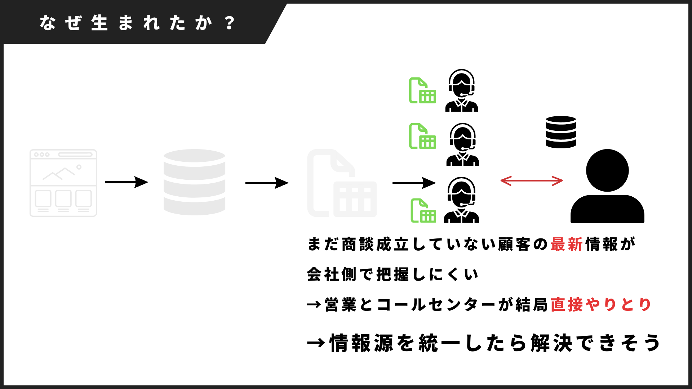
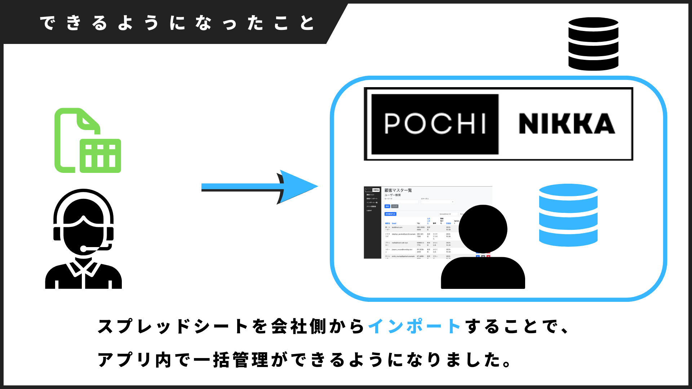
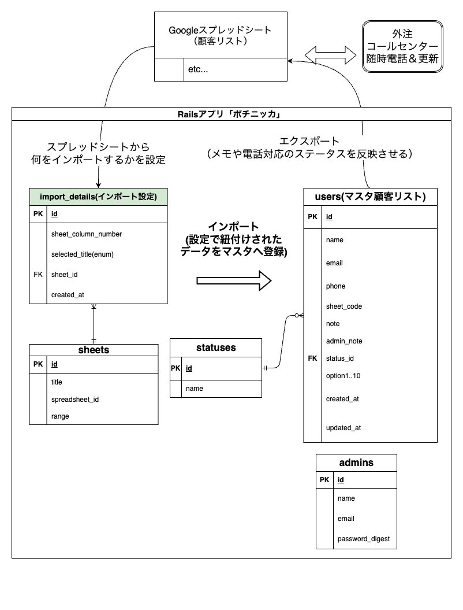
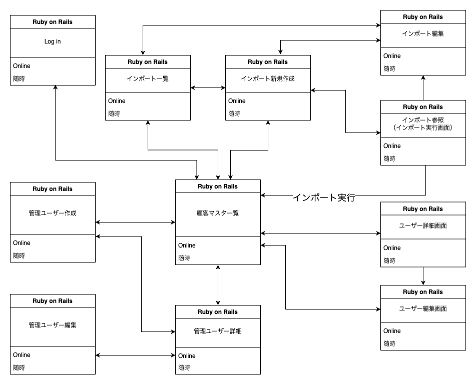

# README

## アプリ概要

### アプリ名「ポチニッカ」

[ポチニッカ（ログイン情報が必要です。）](https://secure-waters-03623-3e2884d834ae.herokuapp.com/)

Googleスプレッドシートの顧客情報を、アプリ内で一括管理できるアプリです。
GoogleAPIとの連携でシートのインポート・エクスポートが出来ます。

## 何故作ったか

本アプリはある企業様の**実際の現場課題を解決**するために生まれました。

具体的な悩みとは「外部コールセンターとの顧客情報の共有をスムーズにしたい」というもの。
どう言うことか、簡単に説明させてください。



まずHPに依頼がくると、社内DBに顧客情報として保存されます。
これが外注先のコールセンターにスプレッドシートとして用意され、実際の電話やりとりが行われます。
最終的に「商談の日程調整」まで進めば、本社の担当者に連絡が届く仕組みでした。



しかしこの場合、商談まで進んでいない「対応中」や「資料送付中」の顧客情報は
スプレッドシート上でしか反映されません。そのため本社の担当者は状況確認時に
一括した社内DBではなく、分割されたスプレッドシートとそのコールセンターに
直接確認する必要がありました。


原因は会社の担当とコールセンターの情報源の統一と、一括での可視化がされていなかった事です。
そのため社内DBとは別に、**アプリで顧客情報を一括で管理すれば解決**できると考えました。

## 開発言語

- Ruby (3.0.1)
- Ruby on Rails (7.0.8)
- PostgreSQL (15.4)

## 使用技術

- google_drive（3.0.7)：GoogleAPI機能の利用
- googleauth(0.17.1)：OAuth2.0アカウントとの連携
- enum_help：enum型値の日本語化に
- ransack：ページの検索機能

- JavaScript： 一部URLの遷移時
- bootstrap：全体のデザイン
- kaminari：ページネーション
- bootstrap5-kaminari-views

## テスト

- RSpec

## 注意事項
※ 企業向けアプリのため、現在**アカウント情報がないとログインができません**。
挙動が確認したい方は、お手数ですが開発者までご連絡ください。

## 実行手順

```bash
$ git clone https://github.com/keikikamikubota/Pochinikka1.0.git
$ bundle install
$ yarn install
$ cd pochinikka
$ rails db:create && rails db:migrate　&& rails db:seed
$ rails s
```


## 要件定義一覧

[要件定義（ポチニッカ）](https://docs.google.com/spreadsheets/d/15msBnQ_21w7erIOCudjj5z0yKSqy1icNbvbcsAl54J8/edit#gid=1929335711)

## ER 図



## 画面遷移図

